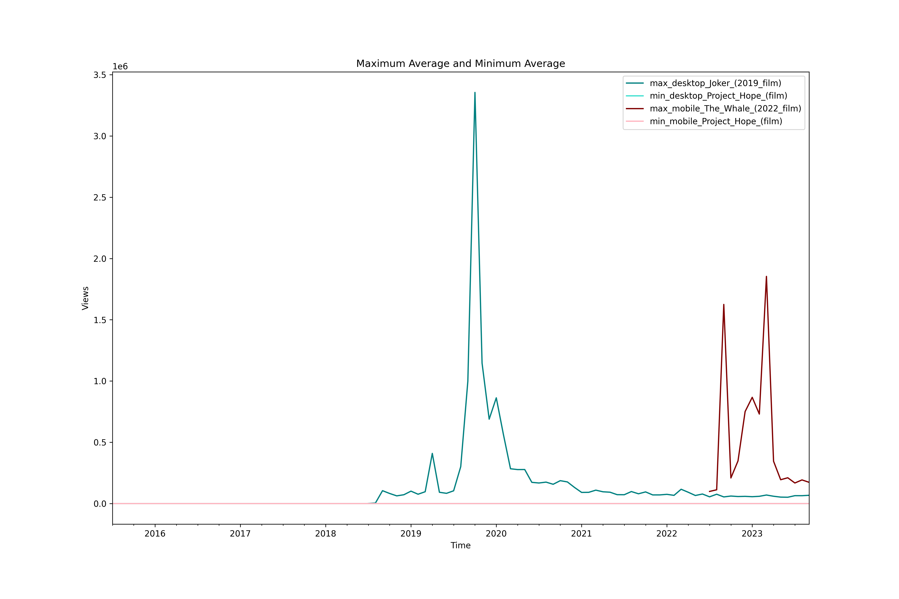
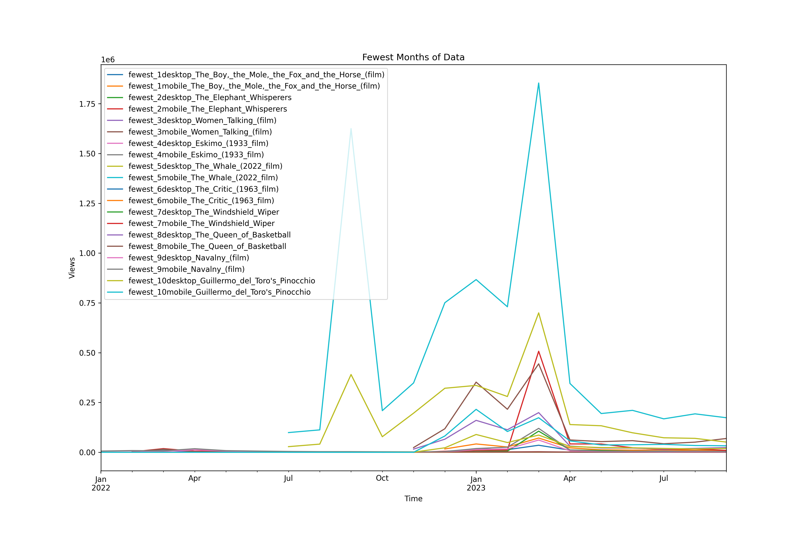

[](https://github.com/sagnikgh1899/data-512-homework_1/blob/main/LICENSE)
# DATA 512: Human Centered Data Science (Autumn 2023)

## Homework 1: Professionalism & Reproducibility
## Goal
The goal of this assignment is to construct, analyze, and publish a dataset of monthly article traffic for a select set of pages from English Wikipedia from July 1, 2015 through September 30, 2023. The purpose of the assignment is to develop and follow best practices for open scientific research.

Based on the readings as outlined in [Assessing Reproducibility](http://www.practicereproducibleresearch.org/core-chapters/2-assessment.html) and and [The Basic Reproducible Workflow Template](http://www.practicereproducibleresearch.org/core-chapters/3-basic.html), the best practices for coding and documentation has been incorporated.

## Data sources and API documentation
- [Articles about academy award winning movies](https://docs.google.com/spreadsheets/d/1A1h_7KAo7KXaVxdScJmIVPTvjb3IuY9oZhNV4ZHxrxw/edit?usp=sharing)
- [Pageviews API documentation](https://wikitech.wikimedia.org/wiki/Analytics/AQS/Pageviews)
- [Pageviews API endpoint](https://wikimedia.org/api/rest_v1/#!/Pageviews_data/get_metrics_pageviews_aggregate_project_access_agent_granularity_start_end)

## Link to licensed sample notebook
- [Sample notebook for API call](https://drive.google.com/file/d/1XjFhd3eXx704tcdfQ4Q1OQn0LWKCRNJm/view?usp=sharing). The sample code is under [CC-BY license](https://creativecommons.org/licenses/by/4.0/)
- [Wikimedia Foundation REST API terms of use](https://www.mediawiki.org/wiki/REST_API#Terms_and_conditions)

## Data files

#### Library installation required
 - pandas
 - tqdm

#### Repository tree
```
.
├── data/
│   ├── academy_monthly_cumulative_201507-202309.json
│   ├── academy_monthly_desktop_201507-202309.json
│   ├── academy_monthly_mobile_201507-202309.json
│   └── thank_the_academy.AUG.2023.csv
├── results/
│   ├── Max_Min_Average_plot.png
│   ├── Top_10_Peak_Page_Views_plot.png
│   └── Fewest_months_plot.png
├── src/
│   ├── Data_Acquisition.ipynb
│   └── Data_Analysis.ipynb
├── LICENSE
└── README.md
```

#### Description
- **data** : A folder containing the output datasets (academy_monthly_cumulative_201507-202309.json, academy_monthly_desktop_201507-202309.json, academy_monthly_mobile_201507-202309.json) and the cleaned .csv file (thank_the_academy.AUG.2023.csv)
- **results** : A folder containing the three plots Max_Min_Average_plot.png, Top_10_Peak_Page_Views_plot.png, Fewest_months_plot.png (described in detail in the .ipynb)
- **src** : A folder containing the .ipynb files. First the Data_Acquisition.ipynb file needs to be executed followed by Data_Analysis.ipynb. They are clearly documented to indicate what they do, containing code as well as information necessary to understand each processing step.
- **LICENSE** : A file that contains an MIT LICENSE for sagnikgh1899/data-512-homework_1 repo.
- **README.md** : A file that contains information to reproduce the analysis, including data descriptions, attributions and provenance information, and descriptions of all relevant resources and documentation (inside and outside the repo) and hyperlinks to those resources.
  
*No creation of intermediate datasets or outputs*

## Special considerations
- It is possible that certain API calls may not return a valid JSON dump due to lag in the server/client side thus a Try/Except block has been added in the code to take this into account.
- For the cumulative output file, access type of "all-access" is considered and a cumulative monthly sum grouped by each article is calculated.
- A sample output of the JSON file is assumed as below:
```json  
[
    {
        "project": "en.wikipedia",
        "article": "12_Years_a_Slave_(film)",
        "granularity": "monthly",
        "timestamp": "2015070100",
        "agent": "user",
        "views": 75458
    }
]
```
## Reproducing the analysis

To reproduce this analysis, follow these steps:

1. Clone this repository to your local machine.
2. Ensure you have Python installed with the required libraries (pandas, matplotlib, tqdm, json).
3. Run Data_Acquisition.ipynb to generate all the required jsons
4. Run Data_Analysis.ipynb to generate all graphs, which will be saved in the results folder
5. Analyze graphs

*Feel free to use, modify, or contribute to this project while adhering to the MIT License.*
    
## Snapshot of analysis output

#### Maximum Average and Minimum Average
 
#### Top 10 Peak Page Views

#### Fewest Months of Data


## Best practices for documentation
- PEP 8 – Style Guide for Python Code ([Reference link](https://peps.python.org/pep-0008/))
- Use of relative path addresses to help in reproducibility
- Use of intuitive variable and function names to ease in understanding
- Appropriate comments and documentation provided for the data aquisition, data processing and data analysis steps
- Description of all data files present in the repository mentioned

## Author
[Sagnik Ghosal](https://github.com/sagnikgh1899) 